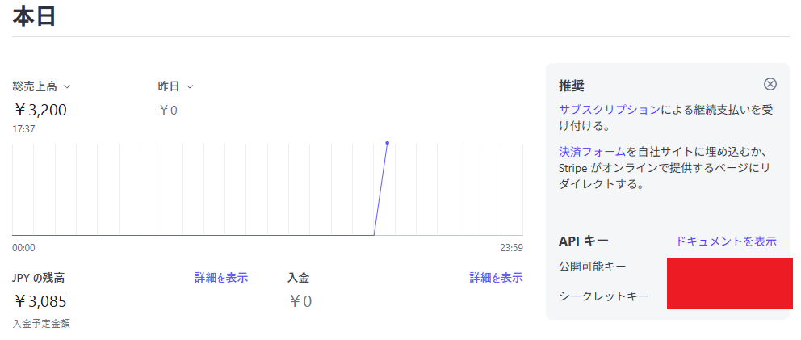
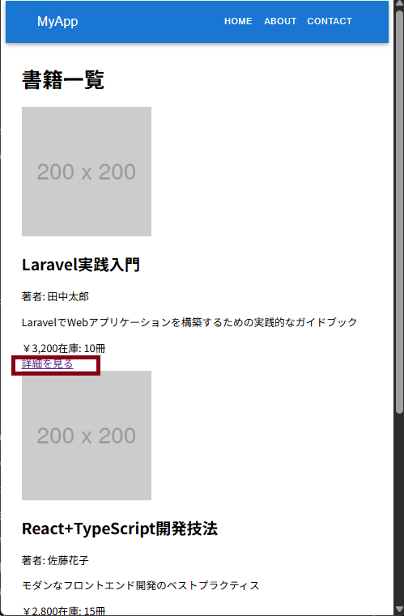
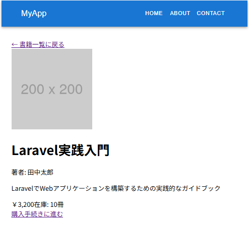
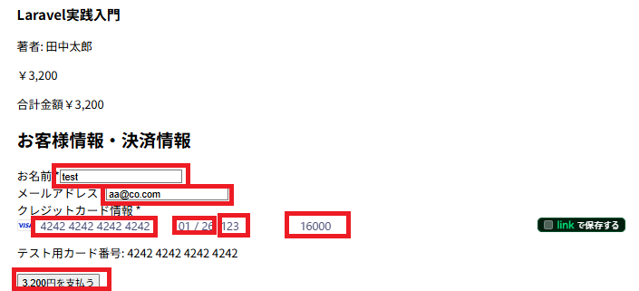
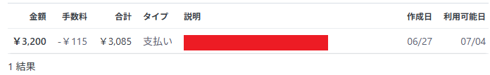

# 概要

このプロジェクトは、DevContainer + Laravel+ Reactの構成で、MVC + Service + Repository のアーキテクチャを採用した雛形として作成しました。

# ローカル環境構築手順

1. Dockerをインストール
2. VsCodeをインストール
3. VsCodeの拡張機能にDevContainersをインストール
4. ソースをクローン
5. プロジェクトルート直下と.devcontainerディレクトリ内に.envを作成

```bash
cp .env.sample .env
cp .devcontainer/.env.sample .env
```

6. Ctrl Shift Pでコマンドパレットを開く<br>
7. DevContainer:Reopen in Containerを押下
8. ライブラリ等のインストール

```
composer install
npm install
```

9. マイグレーション実行
   Ctrl Shift P→run task→migration freshを選択<br>
   サンプルデータの投入も行われます。

# 技術スタック

## 使用技術

バックエンド: Laravel 12系<br>
フロントエンド: React 19、Type Script 5.8

## 開発環境

DevContainer<br>
Inertia<br>
Vite HMR

## コード品質管理

PHPCsFixer<br>
PHP Intelephense<br>
Prettier
ESLint

## デバッガ

バックエンド:Xdebug

フロント:[こちら](https://zenn.dev/chida/articles/a12f72ed8153b0)を参照

## テスト方法

1.テストコマンドを実行

```bsash
php artisan test
```

## stripeによる決済処理の動作確認手順

1. stripeにアカウント登録を行い、公開鍵と秘密鍵を取得する
   
2. プロジェクトルート直下のENVに値をセットする<br>
   ⚠️.devcontainer配下ではありませんよ

```
STRIPE_PUBLISHABLE_KEY=pk_test_xxxxxxxxxx
STRIPE_SECRET_KEY=sk_test_xxxxxxxxxx
```

3. フロントサーバー起動<br>
   VsCodeを選んだ状態でCtrl+@でターミナルを開く

```
npm run dev
```

4. http://127.0.0.1:8000/books にアクセス<br>
   適当な書籍の詳細を見るを押下<br>
   

5. 購入手続きに進むを押下
   
6. スクショの内容を入力して支払うを押下
   
7. stripeに履歴が追加される
   
